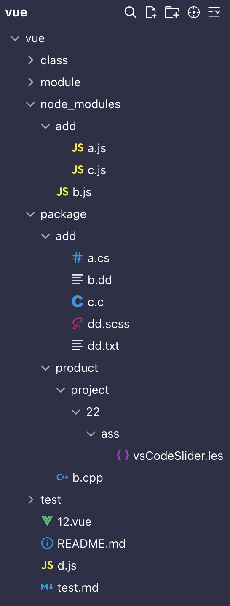
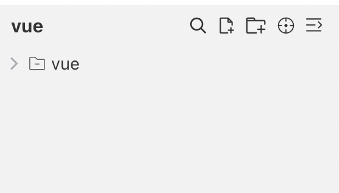
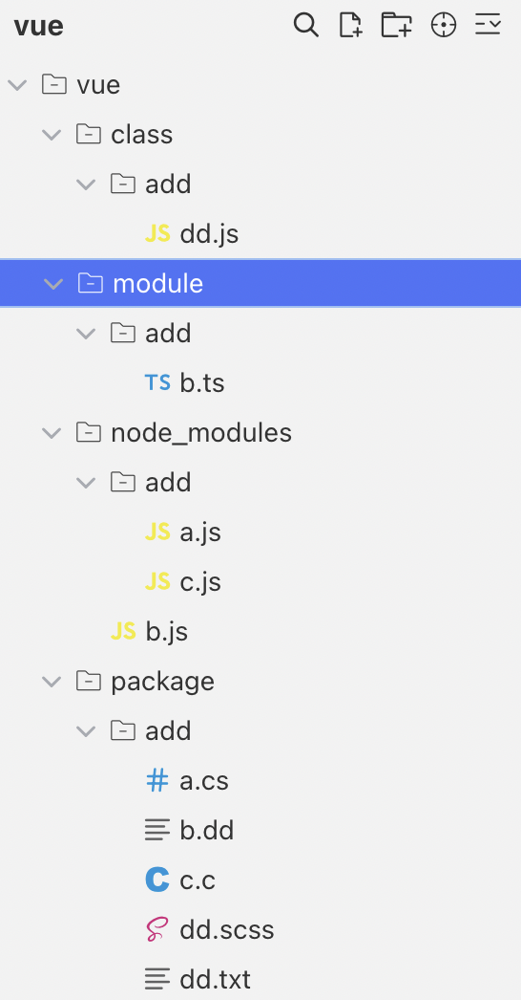
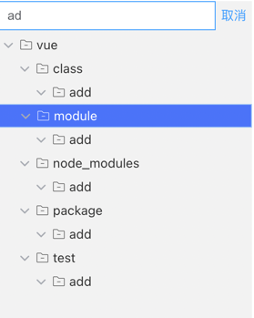
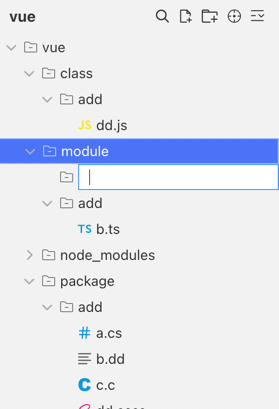
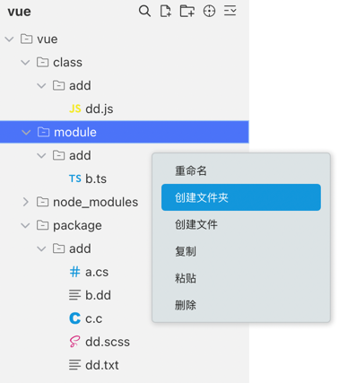
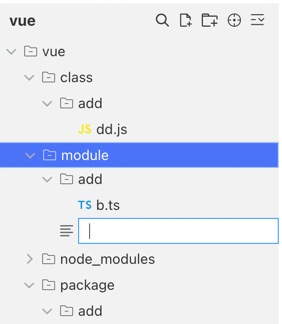
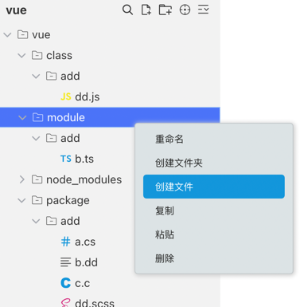

# vs-code-slider

基于vue3实现仿vs-code的侧边文件管理菜单

## 使用

```sh

pnpm install vs-code-slider

```

## 查看demo

```sh

clone 代码到本地

pnpm install vs-code-slider

pnpm dev

```
效果如下：<br>



## 1. 文件类型的图标：

| 文件类型                 | 图标                                                            | 文件类型            | 图标                                                               | 文件类型            | 图标                                                              | 文件类型      | 图标                                                             |
|----------------------|---------------------------------------------------------------|-----------------|------------------------------------------------------------------|-----------------|-----------------------------------------------------------------|-----------|----------------------------------------------------------------|
| .c                   |      | .cpp            |        | .cs             |       | .cjs      |     |
| .css                 |    | .git、.gitignore |       | .go             |       | .html     |    |
| .png、.jpeg、.jpg、.gif |  | .java           |      | .js             |       | .json     |    |
| .less                |   | .license        |   | .log、.changelog |      | .md       |      |
| .npm                 |    | .python         |    | .react          |    | readme.md |  |
| .scss、.sass          |   | .setting        |   | .svg            |      | .tpl      |     |
| .ts                  |     | .tsconfig       |  | .vue            |      | .xml      |     |
| .yaml                |   | .tsconfig       |  | 默认              |  |       |     |

如不满足，可以issues留言增加

如何使用组件呢，参考[demo](https://github.com/aydk-xcc/vs-code-slider/blob/master/example/src/App.vue)：
```vue
<script setup lang="ts">
import VsCodeSlider from 'vs-code-slider';
import {ref} from 'vue';

const arr = ref([
    'vue/d.js',
    'vue/README.md',
    'vue/12.vue',
    'vue/test.md'
]);

</script>

<template>
    <VsCodeSlider
        :files="arr"
    />
</template>
<style scoped>
</style>
```
组件的props说明如下：

| prop        | 类型              | 可选值 | 默认值         | 说明                                                      |
|-------------|-----------------|-----|-------------|---------------------------------------------------------|
| baseDir     | string          | -   | -           | 展示在组件左上角的名称，当不传时，默认是file解析之后的最外层目录名称，如果解析之后有多个，则显示'未命名' |
| files       | Array\<string\> | -   | []          | 文件数组,当前支持的是完整文件的path组成的数组，具体可以参考例子,组件会自动对层级进行处理和排序      |
| theme       | string          | -   | light/dark  | 暗黑主题和白色主题                                               |
| width       | number          | -   | 280         | 侧边栏的默认宽度                                                |
| defaultOpen | bool            | -   | false       | 是否默认展示一级目录                                              |
| currentFile | sting           | -   | 最后一次点击的文件名称 | 当前正在查看的文件，为了顶部的定位到当前文件来使用                               |
| bgColor     | string          | -   | -           | 侧边栏的背景色，优先级最高                                           |
| disabled    | bool          | -   | false       | 是否禁用操作                                                  |
## 2.功能
部分功能完善中，欢迎pr

### 2.1 文件排序
已支持，默认对文件的按照字母序升序进行排序，同级内文件和字母各自按照升序排列

### 2.2 全部展开和全部收起
|全部收起| 全部展开                             |
|-------|----------------------------------|
||  |

### 2.3 查找


### 2.4 定位
待支持

### 2.5 增加文件夹
| 点击上方按钮                            | 右键添加                              |
|-----------------------------------|-----------------------------------|
|  |  |
### 2.6 增加文件
| 点击上方按钮                          | 右键添加                              |
|---------------------------------|-----------------------------------|
|  |  |

### 2.7 配置主题
待支持


